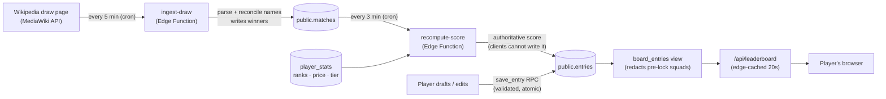

> **⚠️ Status is partly out of date (Aug 4).** For the current, code‑verified status and the
> prioritised per‑item action plan, see **[ACTION_PLAN_2026-08.md](./ACTION_PLAN_2026-08.md)**.
> Notably now DONE (this doc still shows open): CI, off‑machine git remote, server‑authoritative
> scoring, RLS hardening; the test count is **300**, not 247. This doc is kept for the product/architecture background.

# Grand Slam GM — Project Status & Roadmap

**A fantasy‑tennis web app. This document is the single source of truth on what the app is, what has been built, its current health, and the plan to make it excellent for the US Open.**

*Prepared for the founder and for any external reviewer (consultant or AI) picking up the project. Written to be understood without prior context. Last updated during the live 2026 National Bank Open (Montréal).*

---

## 0. How to read this document

- **Sections 1–2** are plain English — what the product is and where it stands. Anyone can read them.
- **Sections 3–5** are technical — architecture, the work completed, and an honest health assessment. For engineers / AI reviewers.
- **Sections 6–8** are the plan — the roadmap to the US Open, the go‑live checklist, and the longer‑term vision.
- Status markers used throughout: ✅ done & verified · 🟡 in progress / partial · 🔴 open, needed · ⚪ optional / later.

---

## 1. Executive summary

**What it is.** Grand Slam GM is a fantasy game for tennis. A player drafts a squad of 10 real ATP pros under a salary‑cap budget, names a captain and vice‑captain, and earns points as those players win real matches in a live tournament. Friends compete on live leaderboards and in private leagues. It is free to play and works on phone and desktop; accounts sync across devices.

**Where it stands today.** The app is **live and working** for the current tournament (National Bank Open, Montréal, Aug 2026), with real users (a private friends league). The core game, the account system, and the live‑scoring data pipeline are all built. Over the last stretch the project went through an intensive **security and data‑integrity hardening pass** — the parts that make sure nobody's squad is lost and nobody's score is wrong — plus a live‑event debugging pass as the real tournament began.

**The headline status / decisions right now.**
1. ✅ **First‑round scoring — resolved for the US Open.** The Montréal app scores from the Round of 64 onward (its opening round is a bye‑heavy "play‑in" the reader parses poorly). For the US Open, the automated draw reader has now been **validated against the real 2025 Grand Slam draw** — all seven rounds, including the fully‑played first round, parse perfectly (127/127 matches) — and the config scores all seven. So at the US Open every match counts from round one.
2. 🟡 **The US Open port — de‑risked, one piece pending.** It is a 128‑player Grand Slam, not a 96‑player Masters. The tournament config is now scaffolded and the draw reader is validated; the main remaining piece is the real **128‑player field + pricing**, which simply waits for the official entry list to publish (~1–2 weeks out).
3. 🔴 **Operational maturity.** Monitoring is manual, there's no automated test gate on deploys, email delivery for new sign‑ups is unverified, and there's no bot/abuse protection. Fine for a handful of friends; must be addressed before a larger US Open audience.

**The goal.** A flawless live experience for the US Open, and a foundation good enough to run the whole tennis season and stand up as a best‑in‑class product.

---

## 2. The product — what the app actually does

| Feature | Description |
|---|---|
| **Draft** | Pick 10 players within a **$150M budget** and a tier quota: **2 Platinum · 3 Gold · 5 Silver** (tiers are set by world ranking). Player prices are modelled from rank, form, and surface. |
| **Captain & Vice** | Your captain scores **×2** and your vice **×1.5** each round. You set them before a round is played. |
| **Live scoring** | As real matches finish, each player who wins earns round points (weighted by the round's stakes and an upset bonus). Points flow automatically to your total. |
| **Leaderboards** | A global public board and unlimited **private leagues** (invite a link, everyone drafts, one leaderboard). |
| **Transfers** | Swap an eliminated player for a still‑alive one mid‑tournament, funded by a partial budget refund, within the transfer window. |
| **Team & bracket views** | A stadium‑style "court" with your squad, a per‑player **points‑by‑round** breakdown, transfer history, and the live tournament bracket with your players highlighted. |
| **Accounts** | Email sign‑up; squad and profile sync to the cloud and across devices. |

**The core loop:** draft before the deadline → set your captain each round → watch real results move your score → make transfers → climb the leaderboard.

---

## 3. Architecture — how it's built

### 3.1 Stack

| Layer | Technology |
|---|---|
| **Frontend** | React + TypeScript, built with Vite, state via Zustand. Hosted on **Cloudflare Pages** (global CDN). |
| **Backend** | **Supabase** — managed PostgreSQL with Row‑Level Security (RLS), Edge Functions (Deno/TypeScript), and scheduled jobs via `pg_cron` + `pg_net`. |
| **Auth** | Supabase Auth (email accounts). |
| **Live data source** | Wikipedia's men's‑singles draw page, read through the CORS‑open MediaWiki API. |
| **Edge caching** | The public leaderboard is served from a Cloudflare Pages Function with a 20‑second edge cache, so board reads scale with the cache, not the user count. |

### 3.2 The live‑scoring pipeline

The chain that turns real match results into leaderboard points, fully automated:



**Key properties of this design:**
- **Scoring is server‑authoritative.** Clients can save their squad but can never write their own score — only the `recompute-score` function (running with the service‑role key) writes the `score` column.
- **Results only move forward.** The ingester never regresses a recorded winner to null on a partial/transient read.
- **Everything is idempotent and self‑healing.** Both jobs recompute from source each run, so a transient failure corrects itself on the next tick.
- **One validated write path.** All squad writes go through the `save_entry` database function, which validates squad legality + concurrency + locks atomically.

### 3.3 Repository map (for reviewers)

```
src/
  data/         game rules, scoring engine, the draw parser, cloud client, tournament config
  store/        Zustand stores (game state, live results, profile, sync)
  components/   court, bracket, cloud-sync, live-feed, etc.
  pages/        Draft, Team, League, Home, Player, Tournament
  scoring/      portable scoring engine (kept identical to the server's)
  __tests__/    247 unit/integration tests — the executable spec of correctness
supabase/
  *.sql         schema, RLS, the save_entry / apply_entry_scores RPCs, hardening migrations
  functions/    ingest-draw & recompute-score Edge Functions (Deno)
functions/api/  the cached public-leaderboard Cloudflare Function
scripts/        safe deploy (build → deploy → verify the live bundle hash)
docs/           LAUNCH_OPS, DEV_WORKFLOW, this document
```

**The test suite is the best entry point for a reviewer.** `npm test` runs 247 tests covering the draft rules, the economy, the scoring engine (client↔server parity), the strict lock semantics, and a 150‑game fuzz of the full play loop.

---

## 4. What has been built (work completed)

This is the record of work to date, grouped by theme. The bulk of recent effort was **data‑integrity hardening** — the guarantees that user data and game data are always correct.

### 4.1 Core game & engine ✅
- Full draft rules (squad size, tier quota, budget economy) and the pricing model (rank × form × surface).
- The scoring engine: round points, ranking multiplier, upset bonus, captain ×2 / vice ×1.5, mid‑tournament transfers with budget refunds.
- A **portable scoring engine** shared verbatim between client and server, pinned identical by a parity test — so the number you see and the number the server writes can never drift.

### 4.2 Live data pipeline ✅
- A pure, dependency‑free **draw parser** shared by the client and the server ingester (no duplication).
- `ingest-draw`: fetches the Wikipedia draw, reconciles player names to the roster, writes match results — atomically, forward‑only, idempotent, with a retry on transient fetch failures.
- `recompute-score`: paginates all entries, computes scores in memory, applies them set‑based; deterministic and self‑healing.
- Scheduled via `pg_cron` (ingest every 5 min, scoring every 3 min).

### 4.3 Security & data integrity ✅ (the major hardening pass)
The two non‑negotiable guarantees driving this work: **(1) every piece of user‑created data is persisted correctly, atomically, durably; (2) every piece of game‑generated data is saved and readable only by the right people.**

- **Edge‑function auth (B1):** the scoring/ingest functions reject anyone but the service‑role cron — verified live (anonymous calls return 401).
- **Single validated write path (F1):** clients can no longer write the entries table directly; every write goes through `save_entry`, which validates squad legality server‑side.
- **Optimistic‑concurrency guard (F2):** a per‑entry revision number prevents two devices from silently clobbering each other.
- **League integrity (B2/B3):** entries are pinned to the canonical public league; rogue/duplicate leagues are blocked.
- **Pre‑lock squad privacy (B8):** a redacting database view hides other players' in‑progress draft squads until they lock, without breaking the public leaderboard.
- **Strict, cheat‑proof result locks (P1/P3/P6):** the captain‑of‑record, the drafted squad, and transfers all **freeze the moment a round produces a result** — you cannot pick a captain, a squad, or a transfer for a match whose outcome you can already see. Enforced authoritatively in the database, mirrored in the UI so honest users are never invited into a doomed edit, and any rejected save now **rolls back** instead of leaving a "ghost" change.
- **Pipeline robustness (Phase 4):** a destructive one‑time cleanup script was neutered so it can't wipe data on a re‑run; re‑runnable SQL that could re‑expose private squads was disabled; a database constraint now rejects an impossible match result; manual result‑corrections were made **durable** (they survive the next automated run); and every ingest run now writes a **health row** so a silent failure is visible.

### 4.4 Product & UX ✅
- A "scoring pending" board state (so a wall of zeros before play reads as *not started*, not *broken*).
- The **live bracket now populates for every user** the moment the draw publishes (previously only an admin could see it), showing seeds against a "TBD" opponent that fills in as the first round is played.
- A per‑player, per‑round **points breakdown** on the Team page.
- Sort the market **by price** (alongside rank and surface win‑%).
- The host‑city name (**MONTRÉAL**) painted on the court baselines, like a TV broadcast; it re‑skins per tournament.
- Mobile‑precision and tier‑ordering passes across the board and squad views.

### 4.5 Engineering foundation ✅
- **Version control** established for all recent work (three organised commits; secrets kept out of the repo).
- **Dev / prod separation:** a safe preview deploy (`dev.grand-slam-gm.pages.dev`) distinct from the live site, so changes can be tested without touching the live app.
- **Safe deploys:** the deploy script wipes stale build output, aborts on a build error, and verifies the live bundle hash after upload.
- **247 automated tests** as the correctness gate, documented in `DEV_WORKFLOW.md`.

---

## 5. Current status & health — the honest assessment

### 5.1 What is solid
- The core game and the scoring engine (heavily tested, client↔server parity).
- The data‑integrity boundaries (auth, RLS, single write path, server‑authoritative scoring).
- Deploy safety and version control.
- The live pipeline is **running and verified healthy** for Montréal (ingest health `ok`, both crons firing).

### 5.2 Open items & known gaps

| # | Item | Severity | Notes |
|---|---|---|---|
| 1 | **First‑round scoring + parser** | ✅ Resolved for the Slam | The parser is now **validated against the real 2025 US Open draw** — all 7 rounds, 127/127 matches captured, first round included (locked in as a regression test). At the US Open every round scores. (Montréal's own opening round stays an unscored play‑in — a minor, event‑specific choice, since its byes make that round unreliable to parse.) |
| 2 | **Shang name fix — server redeploy pending** | 🟡 | A name‑matching fix (family‑name‑first names like "Shang Juncheng") is deployed to the client; the ingest Edge Function still needs the one‑click redeploy to store the correct id. |
| 3 | **No email delivery verified (custom SMTP)** | 🔴 High | Supabase's built‑in email sender is rate‑limited and "not for production." Without a real email provider, new sign‑ups may never receive a confirmation and **cannot log in**. Fine for existing users; a blocker for a wider US Open audience. |
| 4 | **No bot/abuse protection** | 🟡 | No CAPTCHA on sign‑up and no app‑level rate limiting. Acceptable for a private friends league; needed before public/wider sharing. |
| 5 | **Free‑tier Supabase** | 🟡 | The free tier auto‑pauses and caps connections; needs the Pro upgrade + connection pooling + a max‑rows cap before scale. |
| 6 | **Monitoring is manual** | 🟡 | Health is queryable (`ingest_health`) but nobody is alerted automatically if ingest/scoring stalls. |
| 7 | **No CI** | 🟡 | Tests are not automatically run on every change; the gate is manual discipline. |
| 8 | **No DB migrations framework** | 🟡 | Schema changes are hand‑run SQL files applied in order; correctness depends on running the right files. |
| 9 | **Accessibility (WCAG)** | ⚪ | No formal accessibility pass yet. |
| 10 | **Dev/prod share one database** | ⚪ | Local/dev writes hit the live Supabase. Fine for UI work; isolate with a second dev project for data‑writing changes. |
| 11 | **No off‑machine backup (git remote)** | 🟡 | The repository is local only; a push to a hosted remote (e.g. GitHub) would protect against machine loss and enable CI. |

### 5.3 Risk posture
The **product and data integrity are strong**; the gaps are in **operational maturity and scale readiness** (email, monitoring, bot protection, CI, upgrade) and in the **US‑Open‑specific work** (a different tournament format). None of the open items threaten existing users' data; they are about being ready for a bigger, higher‑stakes event.

---

## 6. Roadmap to the US Open

**Target:** a flawless live experience for the US Open (a 128‑player Grand Slam; men's main draw runs late August into September 2026 — *confirm the official dates & order of play*). That's roughly **four weeks** from now. Work is organised into four parallel workstreams; a suggested week‑by‑week sequence follows.

### Workstream A — Finish the current event (this week) 🔴
Small, closes out Montréal cleanly and de‑risks the pipeline.
- **A1** Redeploy the ingest function (Shang name fix). *(minutes)*
- **A2** Decide first‑round scoring policy (see B‑stream) and, if scoring it, **fix + validate the first‑round parser** against live data. *(1–2 days)*
- **A3** Stand up basic monitoring: a simple recurring check that alerts if `ingest_health` goes stale or a cron stops. *(0.5 day)*

### Workstream B — US Open readiness (weeks 1–2) 🟡 *mostly de‑risked; the field is the remaining piece*
The US Open is a genuine port, not a config toggle — but the two hardest parts are now done: the config is scaffolded and the draw reader is proven on the real Grand Slam format.
- ✅ **B1 (done)** Added the **US Open tournament config** (staged, off): 128 draw, **7 rounds (R128 → F)**, placeholder schedule, US Open blue court.
- 🔴 **B2 (the remaining piece — waiting on data)** Build the **128‑player field** and the **pricing model + tier seed** (`player_stats`), mirroring the Montréal setup. Blocked only on the official entry list publishing (~1–2 weeks before the event). *(1–2 days once the list is out)*
- ✅ **B3 (done — the big de‑risk)** Validated the draw parser against the **real 2025 US Open draw**: all 7 rounds, 127/127 matches captured, first round included — locked in as a regression test. Grand Slams have no byes, so the opening round parses cleanly (unlike Montréal's).
- 🟢 **B4 (handled)** The config scores all 7 rounds, so round 1 counts for everyone; the engine already carries a round‑1 point value. Revisit only to tune the value.
- 🟡 **B5** **Stage it** on the preview URL (`VITE_ACTIVE_TOURNAMENT=usopen_2026`) and run the full pipeline end‑to‑end on the real draw before flipping it live. *(0.5 day, once B2 is in)*

### Workstream C — Reliability & scale (weeks 1–3) 🟡
Turn "works for friends" into "works for a crowd."
- **C1** **Custom SMTP** (Resend/SES/Postmark) so sign‑up confirmations actually arrive — **the top launch blocker** for new users. *(0.5 day)*
- **C2** **Turnstile CAPTCHA** on sign‑up + **Cloudflare rate‑limiting** on the API — bot/abuse protection. *(0.5 day)*
- **C3** **Supabase Pro** upgrade + transaction pooler + a max‑rows cap (blunts scraping, protects egress). *(0.5 day)*
- **C4** **CI**: push the repo to a hosted git remote and run the 247 tests automatically on every change. *(0.5 day)*
- **C5** Real **monitoring/alerting** for both crons and the ingest health signal. *(0.5–1 day)*
- **C6** *(nice‑to‑have)* a lightweight **DB migrations** convention to replace hand‑run SQL. *(1 day)*

### Workstream D — Product polish (weeks 2–4) 🟡/⚪
Make it feel best‑in‑class.
- **D1** Onboarding & rules clarity (first‑run tutorial, clearer scoring explanation).
- **D2** An in‑app **health/status banner** for the admin (last update, any unmatched players) — the data already exists.
- **D3** **Round reminders / notifications** (set your captain before the deadline).
- **D4** Accessibility pass (WCAG AA basics: contrast, focus states, labels).
- **D5** Richer player insight (recent form, head‑to‑head, surface stats) surfaced in the draft.

### Suggested sequence

| Week | Focus |
|---|---|
| **Week 1** | A1–A3 (close Montréal) · ✅ *B1 + B3 already done — config scaffolded, parser validated* · C1 (email) · C4 (git remote + CI) |
| **Week 2** | **B2 the moment the entry list publishes** (field + pricing) · C2–C3 (bot protection + Pro) · D1 (onboarding) |
| **Week 3** | B5 (staging dry‑run on the live US Open draw) · C5 (monitoring) · D2 (admin banner) |
| **Week 4** | Buffer + final go‑live checklist · D3–D5 (polish) · launch |

---

## 7. US Open go‑live checklist

A launch is **go** only when all of these are true:

- [ ] US Open config live: 128 draw, 7 rounds, correct dates, court theme.
- [ ] 128‑player field + pricing + tier seed loaded and sanity‑checked.
- [ ] **Parser validated on the real US Open draw** — every round's results captured, zero drafted‑player name mismatches (checked via `ingest_health.drafted_missing`).
- [ ] Scoring rules finalised (round‑1 policy) and the engine + tests updated & green.
- [ ] Full pipeline dry‑run on staging against the live draw: ingest → score → board, end to end.
- [ ] Custom SMTP verified (a fresh sign‑up receives its confirmation in < 1 min).
- [ ] CAPTCHA + rate limiting on.
- [ ] Supabase Pro + pooling + row cap.
- [ ] Monitoring/alerting live for both crons.
- [ ] 247 tests green + typecheck + production build clean.
- [ ] Rollback plan confirmed (previous deploy is one click away).

---

## 8. Beyond the US Open — "best in market" vision

The architecture already supports a **multi‑tournament season**, which is the biggest strategic asset:

- **Run the whole tour.** One tournament flows into the next (the config supports staging the next event while the current one runs). A continuous season with a season‑long meta‑leaderboard is the differentiator vs. one‑off fantasy games.
- **Reduce the single point of dependency.** The pipeline reads Wikipedia; a secondary/official data feed (or a human‑override workflow, already partly built) would harden result accuracy and timeliness.
- **Social depth.** Rivalry hooks, head‑to‑head, mini‑leagues, chat/trash‑talk, shareable results.
- **Insight.** Player analytics, "who to captain" suggestions, draft value tools.
- **Reach.** Package as an installable PWA; consider native later. A polished onboarding + notifications drives retention.
- **Sustainability.** If desired, a light monetisation path (cosmetics, premium leagues) — only after the free experience is excellent.

**The north star:** the most reliable, most social, season‑long fantasy tennis product available — where every real match instantly and correctly moves your score, and your friends are one link away.

---

*This document is version‑controlled in the repository (`docs/PROJECT_STATUS_AND_ROADMAP.md`). For the technical workflow see `docs/DEV_WORKFLOW.md`; for the operational launch checklist see `docs/LAUNCH_OPS.md`.*
